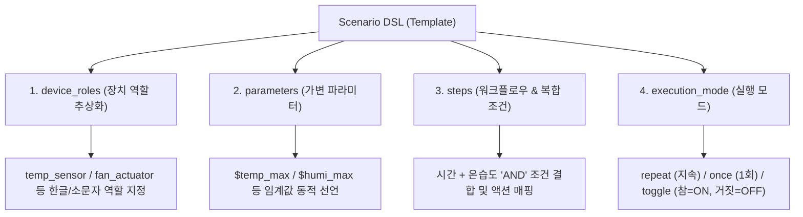

# 🎭 TasMind 시나리오 템플릿 생성 구조, 규칙 및 예제 상세 가이드

**시나리오 템플릿 (Scenario DSL)**은 하드웨어 장치 ID에 직접 종속되지 않는 **추상화된 장치 역할(device_roles)**과 **가변 파라미터(parameters)**, 그리고 **복합 논리 조건(steps)**으로 구성된 스마트 자동화 설계 도안입니다.

등록된 시나리오 템플릿은 사용자의 가상 노드(Virtual Node) 및 실제 디바이스에 연결(Binding)되어 Tasmota 물리 로컬 룰(Rule1~3) 또는 서버 룰 엔진으로 자동 컴파일 및 실행됩니다.

---

## 📑 목차
1. [시나리오 템플릿 생성 구조 & 핵심 개념](#1-시나리오-템플릿-생성-구조--핵심-개념)
2. [시나리오 작성 문법 및 필수 규칙](#2-시나리오-작성-문법-및-필수-규칙)
3. [실행 모드 (Execution Modes) 체계](#3-실행-모드-execution-modes-체계)
4. [상세 예제 1: 스마트홈 — 퇴근길 자동 귀가 쾌적 케어 (Toggle 모드)](#상세-예제-1-스마트홈--퇴근길-자동-귀가-쾌적-케어-toggle-모드)
5. [상세 예제 2: 스마트팜 — 온실 고온/다습 비상 제습 및 환기 (Backlog 연동)](#상세-예제-2-스마트팜--온실-고온다습-비상-제습-및-환기-backlog-연동)
6. [상세 예제 3: 스마트공장 — 야간 과전력 및 고온 화재 예방 차단 (Once 모드)](#상세-예제-3-스마트공장--야간-과전력-및-고온-화재-예방-차단-once-모드)
7. [상세 예제 4: 스마트빌딩 — 업무시간 일광 조율 및 자동 절전 (Repeat 모드)](#상세-예제-4-스마트빌딩--업무시간-일광-조율-및-자동-절전-repeat-모드)
8. [시나리오 생성 및 적용 시 필수 준수 사항](#8-시나리오-생성-및-적용-시-필수-준수-사항)

---

## 1. 시나리오 템플릿 생성 구조 & 핵심 개념

시나리오 템플릿은 최상위 속성 및 3대 핵심 구성 요소로 나누어집니다.



### 📌 최상위 메타데이터 속성 (Top-level Properties)

- **`version`** (`string`): 스키마 버전 (표준 `"2.0"`)
- **`id`** (`string`): 시나리오 식별 ID (예: `"sc_09f2c9e6"`)
- **`domain`** (`string`): 적용 도메인 (`smart_home`, `smart_farm`, `smart_factory`, `smart_building`)
- **`name`** (`string`): 시나리오 명칭 (예: `"쾌적 온습도 자동 제어"`)
- **`description`** (`string`): 시나리오 동작 목적 설명
- **`tags`** (`array`): 카테고리 태그 목록 (예: `["temperature", "humidity", "ventilation"]`)
- **`execution_mode`** (`string`): 룰 발동 패턴 (`repeat`, `once`, `toggle`)

---

## 2. 시나리오 작성 문법 및 필수 규칙

### ① 장치 역할 추상화 (`device_roles`)
특정 하드웨어 ID(예: `tasmota_ai2`) 대신 소문자 스네이크 표기법의 역할명(`role`)으로 정의합니다.
```json
"device_roles": [
  { "role": "living_room_temp", "capability": "sensor", "description": "거실 온도 센서" },
  { "role": "aircon_actuator", "capability": "power", "description": "에어컨 제어 스위치" }
]
```
> [!NOTE]
> `time`(시간), `system`(시스템 이벤트), `system_variable` 같은 가상 역할(Virtual Role)은 `device_roles`에 선언하지 않고 `steps` 조건문에서 직접 사용할 수 있습니다.

### ② 가변 파라미터 (`parameters`)
온습도 임계값이나 작동 시간을 동적으로 바인딩할 수 있도록 선언합니다. `steps` 내부에서 **`$`** 접두어로 참조합니다 (예: `"$temp_max"`).
```json
"parameters": [
  { "name": "temp_max", "type": "number", "default": 28, "description": "에어컨 가동 상한 온도" }
]
```

### ③ 워크플로우 단계 (`steps`)
조건 감지 및 제어 액션을 정의하는 블록입니다.
- **`step_type`**: `"cross_device_trigger"` (크로스 디바이스 조건 트리거), `"condition"`, `"action"`
- **`logic`**: `"AND"` (모든 조건 충족 시), `"OR"` (조건 중 하나라도 충족 시)

---

## 3. 실행 모드 (Execution Modes) 체계

| 실행 모드 | 동작 방식 | 주요 사용 처 |
| :---: | :--- | :--- |
| **`repeat`** | 조건이 참(True)으로 유지되는 동안 주기적으로 지속 제어 명령 전송 | 정밀 보온/냉방, 지속 상태 모니터링 |
| **`once`** | 조건 충족 시 **단 1회만 제어** 실행 후 룰 일시 대기 | 비상 정지, 경보 알림, 단발성 백로그 차단 |
| **`toggle`** | 조건 충족 시 제어 가동(ON), **조건 해제 시 이전 상태로 자동 복원(Rollback/OFF)** | 쾌적 온습도 가동, 자동 조명, 팬 환기 |

---

## 상세 예제 1: 스마트홈 — 퇴근길 자동 귀가 쾌적 케어 (Toggle 모드)

### 💬 1. 자연어 대화 방식 (User ↔ AI Agent)

> **사용자**:
> *"스마트홈 도메인에 '퇴근길 자동 귀가 쾌적 케어' 시나리오 만들어줘. 오후 5시부터 8시 사이에 거실 온도가 27도 이상이면 거실등과 에어컨을 켜고, 조건이 해제되면 자동으로 꺼지도록 해줘. 파라미터는 temp_max(기본 27)로 설정해주고 execution_mode는 toggle로 지정해줘."*

> **AI Agent**:
> *"네! 스마트홈 도메인에 퇴근길 쾌적 케어 시나리오 템플릿을 생성했습니다. 🚀"*
> - **시나리오 ID**: `sc_home_care_01`
> - **실행 모드**: `toggle` (조건 만족 시 ON, 해제 시 OFF 자동 복원)
> - **장치 역할**: `living_temp_sensor`, `living_light`, `aircon_actuator`
> - **파라미터**: `temp_max` (기본값 27°C)

---

### 📄 2. 시나리오 DSL (JSON) 코드

```json
{
  "version": "2.0",
  "id": "sc_home_care_01",
  "domain": "smart_home",
  "name": "퇴근길 자동 귀가 쾌적 케어",
  "description": "오후 5시~8시 사이 거실 온도가 상한치를 초과하면 조명과 에어컨을 가동하고 조건 해제 시 원상태 복원",
  "tags": ["smart_home", "temperature", "light", "aircon"],
  "execution_mode": "toggle",
  "device_roles": [
    { "role": "living_temp_sensor", "capability": "sensor", "description": "거실 온도 감지 센서" },
    { "role": "living_light", "capability": "power", "description": "거실 메인 조명" },
    { "role": "aircon_actuator", "capability": "power", "description": "거실 에어컨 릴레이" }
  ],
  "parameters": [
    { "name": "temp_max", "type": "number", "default": 27, "description": "에어컨 작동 임계 온도 (°C)" }
  ],
  "steps": [
    {
      "step": 1,
      "name": "퇴근시간 고온 감지 및 조명/에어컨 연동 가동",
      "type": "cross_device_trigger",
      "logic": "AND",
      "conditions": [
        { "role": "time", "field": "hour", "operator": ">=", "value": 17 },
        { "role": "time", "field": "hour", "operator": "<=", "value": 20 },
        { "role": "living_temp_sensor", "sensor_type": "AM2301", "field": "Temperature", "operator": ">=", "value": "$temp_max" }
      ],
      "actions": [
        { "role": "living_light", "command": "Power1", "payload": "ON" },
        { "role": "aircon_actuator", "command": "Power1", "payload": "ON" }
      ]
    }
  ]
}
```

---

### 🔍 3. 예제 구조 및 동작 상세 설명

1. **시간 + 온습도 복합 조건의 `AND` 결합**:
   - `time` 역할의 `hour` 조건(17시~20시)과 `living_temp_sensor`의 `Temperature` 조건이 단일 `conditions` 배열 내에 `logic: "AND"`로 결합되어 있어, **밤 시간대 오작동을 차단**합니다.
2. **`toggle` 모드의 롤백 동작**:
   - 오후 8시가 지나거나 온도가 27°C 미만으로 내려가면 조건이 `False`가 되며, 시스템이 자동으로 `living_light`와 `aircon_actuator`에 `OFF` 명령을 전송하여 **원상태로 자동 복원**합니다.

---

## 상세 예제 2: 스마트팜 — 온실 고온/다습 비상 제습 및 환기 (Backlog 연동)

### 💬 1. 자연어 대화 방식 (User ↔ AI Agent)

> **사용자**:
> *"스마트팜용 온실 고온 다습 비상 환기 시나리오 등록해줘. 주간(오전 8시~오후 6시)에 온도가 30도 이상이거나 습도가 80% 이상이면, 환풍기 전원을 켜고 10초 대기 후 환기창 블라인드를 100% 열도록 백로그 명령을 보내줘. 실행 모드는 once로 설정해줘."*

> **AI Agent**:
> *"요청하신 스마트팜 비상 환기 시나리오 템플릿 등록을 완료했습니다! 🌿"*
> - **시나리오 ID**: `sc_farm_vent_02`
> - **실행 모드**: `once` (1회 동작 후 재트리거 대기)
> - **Backlog 연동**: `Power1 ON; Delay 100; ShutterPosition1 100`

---

### 📄 2. 시나리오 DSL (JSON) 코드

```json
{
  "version": "2.0",
  "id": "sc_farm_vent_02",
  "domain": "smart_farm",
  "name": "온실 고온/다습 비상 제습 및 환기",
  "description": "주간 시간대 고온 또는 다습 발생 시 환풍기를 가동하고 10초 후 환기창을 완전 개방",
  "tags": ["smart_farm", "greenhouse", "ventilation", "humidity"],
  "execution_mode": "once",
  "device_roles": [
    { "role": "greenhouse_env_sensor", "capability": "sensor", "description": "온실 온습도 복합 센서" },
    { "role": "exhaust_fan", "capability": "power", "description": "배기 환풍기 릴레이" },
    { "role": "window_shutter", "capability": "shutter", "description": "천장 환기창 셔터" }
  ],
  "parameters": [
    { "name": "temp_crit", "type": "number", "default": 30, "description": "비상 환기 온도 임계값" },
    { "name": "humi_crit", "type": "number", "default": 80, "description": "비상 제습 습도 임계값" }
  ],
  "steps": [
    {
      "step": 1,
      "name": "주간 고온/다습 비상 감지 및 백로그 시퀀스 연동",
      "type": "cross_device_trigger",
      "logic": "AND",
      "conditions": [
        { "role": "time", "field": "hour", "operator": ">=", "value": 8 },
        { "role": "time", "field": "hour", "operator": "<=", "value": 18 },
        { "role": "greenhouse_env_sensor", "sensor_type": "AM2301", "field": "Temperature", "operator": ">=", "value": "$temp_crit" }
      ],
      "actions": [
        {
          "role": "exhaust_fan",
          "command": "Backlog",
          "payload": "Power1 ON; Delay 100; ShutterPosition1 100"
        }
      ]
    }
  ]
}
```

---

### 🔍 3. 예제 구조 및 동작 상세 설명

1. **Backlog 제어 다중 체인결합**:
   - `actions` 내부의 `command`로 `"Backlog"`를 지정하고, `payload`에 `Power1 ON; Delay 100; ShutterPosition1 100`을 명시하여 **단 하나의 MQTT 명령으로 팬 켜기 ➡️ 10초 대기 ➡️ 셔터 열기를 일괄 순차 실행**합니다.
2. **`once` 모드의 안전성**:
   - 1회 기동 후 모터 및 팬이 안정될 때까지 룰이 지속 재발동하는 현상을 방지합니다.

---

## 상세 예제 3: 스마트공장 — 야간 과전력 및 고온 화재 예방 차단 (Once 모드)

### 💬 1. 자연어 대화 방식 (User ↔ AI Agent)

> **사용자**:
> *"스마트공장 도메인에 야간 과전력 화재 예방 차단 시나리오 만들어줘. 야간 시간(오후 10시~오전 6시)에 센서 온도가 55도 이상이거나 실시간 전력이 3000W를 초과하면 공정 전원 플러그를 즉시 차단하고 경보음을 울려줘. execution_mode는 once로 해줘."*

---

### 📄 2. 시나리오 DSL (JSON) 코드

```json
{
  "version": "2.0",
  "id": "sc_factory_safety_03",
  "domain": "smart_factory",
  "name": "야간 과전력 및 고온 화재 예방 차단",
  "description": "야간 비가동 시간대 과전력 소비 또는 라인 고온 감지 시 라인 전원 즉시 차단",
  "tags": ["smart_factory", "safety", "power_cutoff", "fire_prevention"],
  "execution_mode": "once",
  "device_roles": [
    { "role": "line_power_meter", "capability": "sensor", "description": "라인 전력 및 온도 센서" },
    { "role": "main_breaker_relay", "capability": "power", "description": "공정 차단기 릴레이" },
    { "role": "alarm_siren", "capability": "power", "description": "비상 경보 사이렌" }
  ],
  "parameters": [
    { "name": "max_power_w", "type": "number", "default": 3000, "description": "야간 소비전력 한계값 (W)" },
    { "name": "max_temp_c", "type": "number", "default": 55, "description": "화재 위험 임계 온도 (°C)" }
  ],
  "steps": [
    {
      "step": 1,
      "name": "야간 비가동 시간 과전력/고온 트립 감지",
      "type": "cross_device_trigger",
      "logic": "AND",
      "conditions": [
        { "role": "time", "field": "hour", "operator": ">=", "value": 22 },
        { "role": "line_power_meter", "sensor_type": "POW", "field": "Power", "operator": ">=", "value": "$max_power_w" }
      ],
      "actions": [
        { "role": "main_breaker_relay", "command": "Power1", "payload": "OFF" },
        { "role": "alarm_siren", "command": "Power1", "payload": "ON" }
      ]
    }
  ]
}
```

---

## 상세 예제 4: 스마트빌딩 — 업무시간 일광 조율 및 자동 절전 (Repeat 모드)

### 💬 1. 자연어 대화 방식 (User ↔ AI Agent)

> **사용자**:
> *"스마트빌딩용 '업무시간 일광 조율 및 자동 절전' 시나리오 등록해줘. 오전 9시부터 오후 6시 사이 사무실 조도 센서가 800 Lux 이상으로 너무 밝으면 블라인드 셔터를 40% 위치로 내리고 조명을 절전 모드로 변경해줘. 모드는 repeat으로 해줘."*

---

### 📄 2. 시나리오 DSL (JSON) 코드

```json
{
  "version": "2.0",
  "id": "sc_bldg_energy_04",
  "domain": "smart_building",
  "name": "업무시간 일광 조율 및 자동 절전",
  "description": "업무 시간대 실내 조도 감지를 통한 차광 셔터 제어 및 조명 절전",
  "tags": ["smart_building", "hvac", "blinds", "energy_saving"],
  "execution_mode": "repeat",
  "device_roles": [
    { "role": "office_lux_sensor", "capability": "sensor", "description": "사무실 조도 센서" },
    { "role": "window_blind", "capability": "shutter", "description": "전동 블라인드 셔터" },
    { "role": "office_dimmer_light", "capability": "power", "description": "사무실 조명 릴레이" }
  ],
  "parameters": [
    { "name": "lux_high", "type": "number", "default": 800, "description": "차광 시작 조도 (Lux)" }
  ],
  "steps": [
    {
      "step": 1,
      "name": "업무시간 태양광 과다 조도 감지",
      "type": "cross_device_trigger",
      "logic": "AND",
      "conditions": [
        { "role": "time", "field": "hour", "operator": ">=", "value": 9 },
        { "role": "time", "field": "hour", "operator": "<=", "value": 18 },
        { "role": "office_lux_sensor", "sensor_type": "BH1750", "field": "Illuminance", "operator": ">=", "value": "$lux_high" }
      ],
      "actions": [
        { "role": "window_blind", "command": "ShutterPosition1", "payload": "40" },
        { "role": "office_dimmer_light", "command": "Power1", "payload": "OFF" }
      ]
    }
  ]
}
```

---

## 8. 시나리오 생성 및 적용 시 필수 준수 사항

> [!CAUTION]
> **시나리오 작성 및 컴파일 시 주의사항**:

1. **시간 조건과 센서 조건의 단일 `AND` 결합 강제**:
   - 시간 범위(예: 08:00~18:00)와 센서 조건(예: 온도 >= 30)을 개별 step으로 분리하지 말고, 반드시 **단일 step 내 `conditions` 배열의 `AND` 결합**으로 작성하세요. (야간 오작동 방지)
2. **Backlog 제어 시 `PulseTime` 대신 `Delay` 사용**:
   - 다중 릴레이 제어 및 시퀀스 작업 시 `Backlog Power1 ON; Delay 100; Power1 OFF` 형태를 사용하세요.
3. **셔터 제어 전 상호 잠금 (`Interlock`) 확인**:
   - 셔터/블라인드 모터가 포함된 시나리오는 정/역방향 릴레이의 동시 전원 공급을 막기 위해 장치 매핑 시 **인터록 설정**을 확인해야 모터 타버림 사고를 예방할 수 있습니다.
4. **Tasmota 로컬 물리 룰 슬롯 용량 제한 (Rule1 ~ Rule3)**:
   - 시나리오가 실제 장치에 적용될 때, Tasmota 메모리 한계(슬롯당 511자)를 초과하는 복잡한 룰은 **서버 룰 엔진(TimescaleDB)으로 폴백**되어 실행됩니다.

---
*문서 작성일: 2026년 7월 6일 | TasMind System Architecture Team*
