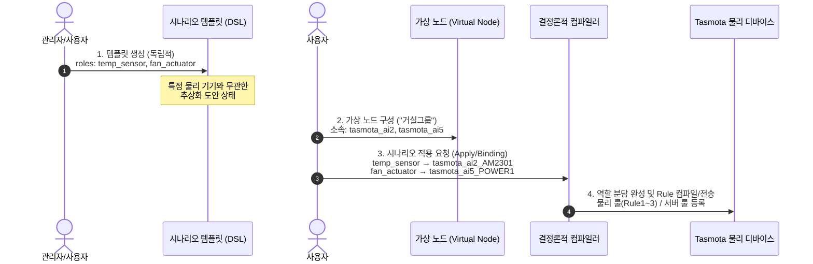

# 🌐 TasMind 가상 노드(Virtual Node) & 시나리오 장치 적용 가이드

본 문서는 **시나리오 생성과 가상 노드의 연동 관계**, **가상 노드의 아키텍처 및 역할**, 그리고 **시나리오 템플릿을 사용자의 실제 디바이스에 바인딩 및 적용하는 파이프라인과 규칙**을 상세하게 설명합니다.

---

## 📑 목차
1. [핵심 질의 답변: 시나리오와 가상 노드의 연동 관계](#1-핵심-질의-답변-시나리오와-가상-노드의-연동-관계)
2. [가상 노드 (Virtual Node) 상세 구조 & 역할](#2-가상-노드-virtual-node-상세-구조--역할)
3. [시나리오 장치 적용 (Scenario Apply) 파이프라인](#3-시나리오-장치-적용-scenario-apply-파이프라인)
4. [장치 바인딩 규칙 및 JSON 명세](#4-장치-바인딩-규칙-및-json-명세)
5. [컴파일 및 룰 등록 체계 (Tasmota 물리 룰 vs 서버 룰)](#5-컴파일-및-룰-등록-체계-tasmota-물리-룰-vs-서버-룰)
6. [단계별 적용 예시 (Step-by-Step Walkthrough)](#6-단계별-적용-예시-step-by-step-walkthrough)

---

## 1. 핵심 질의 답변: 시나리오와 가상 노드의 연동 관계

> **Q. 시나리오 생성할 때 가상 노드에 의해 기기간 연동이 규정되는가? 아니면 시나리오를 적용할 때 가상 노드에 의한 기기간 연동에 따라 역할 분담이 되는가?**

### 💡 정답: **후자입니다! (시나리오 적용 시점에 가상 노드와 소속 기기에 의해 역할 분담 및 연동이 결정됩니다)**



### 1) 시나리오 템플릿 생성 시점 (Creation Phase)
- 물리적 가상 노드나 하드웨어 ID와 **완전히 독립적(Unbound/Abstracted)**입니다.
- 시나리오 템플릿을 생성할 때는 오직 추상화된 명칭의 **장치 역할(`device_roles`)**(예: `living_temp_sensor`, `aircon_actuator`)과 **논리 워크플로우(`steps`)**만 정의합니다.

### 2) 시나리오 적용 시점 (Application Phase)
- 사용자가 등록된 시나리오 템플릿을 자신의 **가상 노드(Virtual Node, 예: "거실", "1동 온실")** 및 실제 기기에 **적용(Binding)**하는 순간!!
- 가상 노드 내 소속된 물리 기기(`tasmota_ai2`, `tasmota_ai5` 등)와 스위치/센서 채널이 시나리오 DSL의 추상역할(`device_roles`)과 **1:1로 매핑(바인딩)되어 역할 분담 및 기기간 실제 연동 규칙이 최종 완성**됩니다.

---

## 2. 가상 노드 (Virtual Node) 상세 구조 & 역할

### 🏢 개념 및 정의
**가상 노드(Virtual Node)**는 서로 다른 물리적 Tasmota 하드웨어 본체, 독립된 온습도/조도 센서, 다채널 릴레이 스위치들을 **하나의 물리적 공간(예: "거실", "안방", "1번 온실")이나 기능 그룹(예: "급수 시스템") 단위로 묶어 관리하는 논리적 컨테이너(Logical Grouping Container)**입니다.

### 🌟 가상 노드의 3대 핵심 역할

1. **통합 그룹 모니터링 & 간편 제어**:
   - 복잡한 기기 ID를 외우지 않고 "거실 노드의 조명 모두 끄기", "온실 노드의 평균 온도 조회" 형태로 일괄 조작할 수 있습니다.
2. **시나리오 적용(Binding)의 스코프 표준화**:
   - 시나리오 템플릿을 내 환경에 적용할 때, 가상 노드 내 소속된 기기들을 AI 및 시스템이 자동으로 탐색하여 `device_roles`에 맞는 기기를 **우선 추천 바인딩**합니다.
3. **하드웨어 유연성 확보 (장치 교체 시 편의성)**:
   - 특정 물리 기기가 고장 나 교체되더라도 가상 노드 매핑만 업데이트해 주면, 기존에 적용되어 있던 **시나리오 전체를 재작성할 필요 없이 즉시 재연동**됩니다.

---

## 3. 시나리오 장치 적용 (Scenario Apply) 파이프라인

시나리오 템플릿이 실제 디바이스를 조작하는 자동화 규칙(Rules)으로 전환되는 4단계 파이프라인입니다.

```
[Step 1. 시나리오 탐색 및 선택] 
  └─ 사용자가 템플릿 ID (예: 'sc_09f2c9e6') 및 요구 파라미터 확인

[Step 2. 디바이스 바인딩 (device_bindings)] 
  └─ 추상 역할(role)과 실제 장치 채널(tasmota_ai2_POWER1) 1:1 매핑

[Step 3. 파라미터 값 주입 (parameter_values)] 
  └─ $temp_max ➡️ 28°C 등 사용자 정의 임계값 바인딩

[Step 4. 결정론적 컴파일러 (Compiler) & 룰 등록] 
  ├─ ① Tasmota 로컬 물리 룰 (Rule1~3 Slot Direct Upload) ➡️ 인터넷 끊겨도 오프라인 자율 동작
  └─ ② 서버 룰 엔진 (TimescaleDB / Server Scheduler Fallback) ➡️ 복합 멀티디바이스 조건 처리
```

---

## 4. 장치 바인딩 규칙 및 JSON 명세

시나리오를 적용할 때 호출하는 `scenario_apply` API의 핵심 매개변수 규칙입니다.

### 📌 1. `device_bindings` (장치 매핑 JSON)
시나리오 DSL의 `device_roles`에 정의된 역할(`role`)과 실제 사용자의 물리 장치/채널을 연결합니다.

```json
{
  "living_temp_sensor": "tasmota_ai2_AM2301",
  "living_light": "tasmota_ai2_POWER1",
  "aircon_actuator": "tasmota_ai5_POWER1"
}
```

> [!WARNING]
> **채널/센서 서픽스(Suffix) 명세 규격**:
> 다채널 릴레이 기기나 여러 센서가 달린 디바이스의 경우, 언더바(`_`)와 채널/센서 명칭을 결합하여 명시해야 백엔드 컴파일러가 정확한 제어 명령을 생성합니다.
> - *릴레이 스위치*: `디바이스ID_POWER1`, `디바이스ID_POWER2` (예: `tasmota_ai2_POWER1`)
> - *센서 모듈*: `디바이스ID_AM2301`, `디바이스ID_DS18B20` (예: `tasmota_ai2_AM2301`)
> - *디바이스 닉네임 지원*: 단순 닉네임(예: `"거실등"`) 입력 시 시스템이 자동으로 디바이스 ID 및 채널 서픽스로 치환합니다.

### 📌 2. `parameter_values` (가변 파라미터 주입 JSON)
시나리오 템플릿에 `$`로 선언된 가변 파라미터에 실제 사용할 수치를 전달합니다.

```json
{
  "temp_max": 28.5,
  "humi_max": 65
}
```

### 📌 3. `execution_mode` (실행 모드 오버라이드)
템플릿의 기본 실행 모드를 내 환경에 맞게 재정의합니다. (`"toggle"`, `"once"`, `"repeat"`)

---

## 5. 컴파일 및 룰 등록 체계 (Tasmota 물리 룰 vs 서버 룰)

컴파일러는 바인딩된 룰을 분석하여 가장 효율적이고 안전한 환경으로 이중 등록합니다.

```mermaid
flowchart TD
    A["Scenario Apply 요청"] --> B["결정론적 컴파일러 분석"]
    B --> C{"단일 기기 내 조건/액션인가?<br>AND 물리 룰 511자 이하인가?"}
    C -->|YES| D["⚡ Tasmota 물리 로컬 룰 컴파일"]
    D --> E["MQTT전송: cmnd/tasmota_ai2/Rule1 ON Switch1#State DO Power2 ON ENDON"]
    E --> F["🟢 기기 CPU 메모리에 직접 탑재 (인터넷 차단 시에도 오프라인 자율 동작)"]
    
    C -->|NO (이종 기기 간 연동 또는 복합 시간/온습도)| G["🖥️ 서버 룰 엔진 컴파일"]
    G --> H["TimescaleDB & 서버 스케줄러 등록"]
    H --> I["🟢 게이트웨이 서버가 센서 모니터링 후 MQTT 명령 제어"]
```

1. **⚡ Tasmota 물리 로컬 룰 (Rule1 ~ Rule3 Slot)**:
   - 조건 감지 센서와 제어 액션 스위치가 **동일한 물리 Tasmota 기기 내에 존재하는 경우**, Tasmota 네이티브 룰 문법으로 전환하여 기기 로컬 룰 메모리에 직접 업로드합니다.
   - **장점**: 게이트웨이 서버나 인터넷 망이 마비된 **오프라인 환경에서도 기기 자체 자율 동작 보장**.
2. **🖥️ 서버 룰 엔진 (Server Rule Engine)**:
   - 감지 센서(`tasmota_ai2`)와 제어 액추에이터(`tasmota_ai5`)가 **서로 다른 물리 기기 간 크로스 연동**이거나 조건이 복잡한 경우 서버 엔진이 센서 데이터를 수집하여 분 단위로 판단 및 제어합니다.
3. **⚡ Tasmota 물리 로컬 룰과 서버 롤 엔진 적용 판단**:
   - 2 개 이상의 장치가 연동되게 적용하면 인공지능은 가급적 tasmota 물리 rule 규칙을 우선적용하려 시도 합니다. tasmota의 rule 슬롯 갯수와 rule 글자 수 제한을 넘어서면 판단하여 적절하게 분배합니다.

---

## 6. 단계별 적용 예시 (Step-by-Step Walkthrough)

### 1단계: 가상 노드 생성 (`Homecontrol_VirtualNode`)
사용자가 거실 구역의 기기들을 묶어 가상 노드를 구성합니다.
- **가상 노드명**: `Homecontrol_VirtualNode`
- **소속 디바이스**: `tasmota_ai2` (온습도 센서 AM2301 탑재), `tasmota_ai5` (에어컨/환풍기 릴레이 탑재)

### 2단계: 적용할 시나리오 템플릿 검색
사용자가 템플릿 모음에서 시나리오 `sc_09f2c9e6` (쾌적 온습도 가동 시나리오)를 선택합니다.
- **필요 역할**: `temperature_sensor`, `living_room_light`, `fan_actuator`
- **필요 파라미터**: `temp_max` (기본값 28)

### 3단계: 장치 바인딩 및 시나리오 적용 명령 전송 (AI 챗 대화)

> **사용자**:
> *"시나리오 sc_09f2c9e6을 내 가상노드 Homecontrol_VirtualNode에 적용해줘. 온습도 센서는 tasmota_ai2의 AM2301을 적용하고 조명은 tasmota_ai2의 거실등, 환풍기는 tasmota_ai5의 환풍기로 매핑해줘. temp_max는 27.5도로 설정하고 toggle 모드로 실행해줘."*

> **AI Agent 연동 동작 (`scenario_apply` 도구 호출)**:
> ```json
> scenario_apply(
>   scenario_id="sc_09f2c9e6",
>   device_bindings='{
>     "temperature_sensor": "tasmota_ai2_AM2301",
>     "living_room_light": "tasmota_ai2_POWER1",
>     "fan_actuator": "tasmota_ai5_POWER1"
>   }',
>   parameter_values='{"temp_max": 27.5}',
>   execution_mode="toggle",
>   applied_by="user_google_id"
> )
> ```

### 4단계: 컴파일 결과 및 최종 적용
- **`tasmota_ai2`**: 물리 룰 컴파일 및 MQTT 로컬 전송 (`cmnd/tasmota_ai2/Rule1 ON AM2301#Temperature>=27.5 DO Power1 ON ENDON`) ➡️ **물리 룰 활성화**
- **`tasmota_ai5`**: 크로스 디바이스 연동 ➡️ **서버 룰 엔진 등록 완료**
- **결과**: 거실 온도가 27.5°C 이상이 되면 거실등과 환풍기가 즉시 켜지고, 27.5°C 미만으로 내려가면 `toggle` 모드에 의해 **자동으로 꺼짐 원상 복원**됩니다.

---
*문서 작성일: 2026년 7월 6일 | TasMind System Architecture Team*
